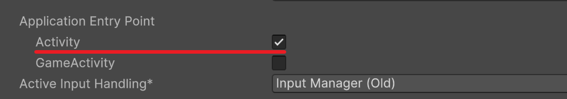

# Android Volume Example
안드로이드 디바이스에서 볼륨 버튼 업 다운을 감지하는 예제입니다.

## 권장 버전  
Unity 2022.3 LTS

## 주의
  
유니티 2023.x부터 Project Settings에 Android/Other Settings를 보면 GameActivity가 추가되었습니다.  
기존 방식처럼 사용하려면 Activity를 사용해주세요.

# 후원
맛있는 자료에는 후원으로 혼내주세요 🥹  
후원 링크 : https://toss.me/nkstudio